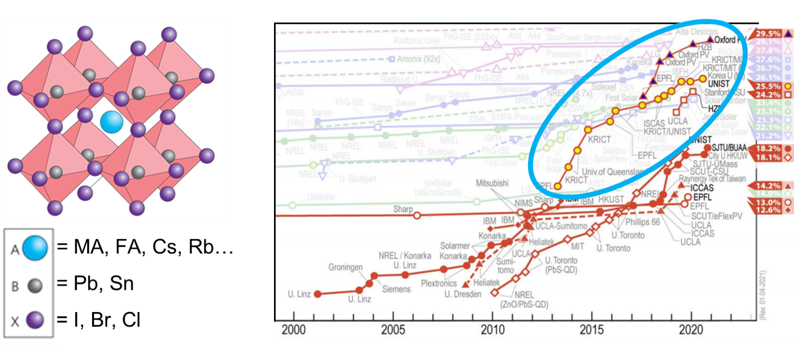
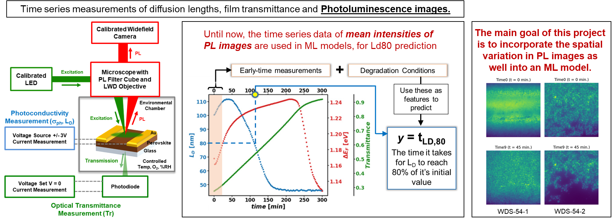
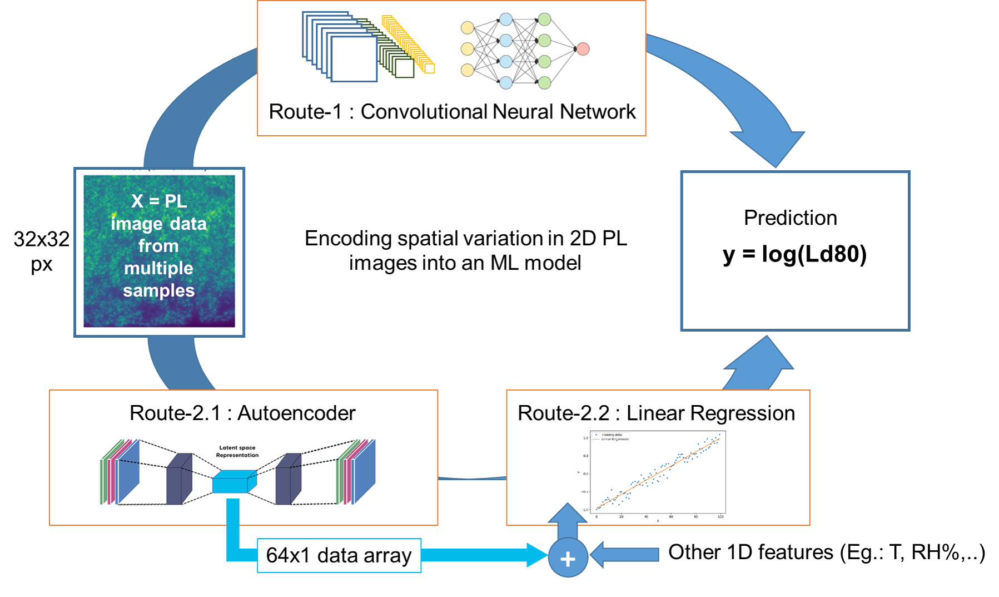

# Decoding spatial heterogeneities in Photoluminiscence images in Perovskite Thin films : <font color='purple'>**TEAM PEROVSKEET**</font>
[](https://coveralls.io/github/afarley9/perovskites?branch=main)
[](https://travis-ci.com/afarley9/perovskites)


## Overview:

**Perovskite solar cells (PSCs)** have seen an increase in photo-conversion efficiencies from 17% to 25.2% in just a span of seven years. Although perovskite solar cells show promising efficiencies, their poor stabilities have restricted their commercial deployment.



PSCs degrade quickly in the presence of oxygen, moisture, thermal stress and illumination, which makes predicting their payback lifetime a challenge for commercial manufacturers. This motivated the Hillhouse Group at the University of Washington, to develop a machine learning model which can predict the ***'lifetime'*** of a perovskite thin film using few early time series measurements and the environmental conditions of degradation. A well-trained model like this would allow the users to quickly test a given perovskites film and be able to predict how long it would last, instead of waiting for the film till failure. This requires a robust and diverse dataset of degradation runs with reliable photoconductivity (PC) and phololuminescence (PL) measurements that give times series of informative optoelectronic properties such as diffusion length, film transmittance etc. [Stoddard et. al.](https://pubs.acs.org/doi/10.1021/acsenergylett.0c00164) demonstrated how these time series data can be used to define the so-called ***degradation lifetime*** of a typical perovskite thin film and and use them to develop a Linear regression machine learning model to predict the lifetime. The article suggests the use of ***log(Ld80)*** which is the logarithm of the time it takes for the thin film's diffion length to reach 80% of its initial value.



Currently, although 2D widefield PL intensity spatial images are taken at each time point of the time series measurements, only the mean PL intensities of these images have been in use as features due to lack of infrastructure to encode the spatial variation in these images. So, this is where our work comes into use.

### Our Goal

To develop a python package that can extract hidden information from spatial heterogeneities observed in PL images of perovskite thin films and quantify it to generate features for use in lifetime prediction models. Currently, PL image processing is primarily implemented in biological fields; we seek to restructure this technology for use in the material characterization of perovskite photovoltaics. This will provide a more robust picture of features which lead to degradation than current state of the art perovskite characterization.



So encode the spatial information in the 2D PL images, we proposed two routes:
1. **Using a Convolutional Neural Network to directly operate on time 0 2D PL images to predict the single values of log(Ld80)**
2. **Using an autoencoder to encode the 2D spatial PL data into a 1D feature array, append it with other environmental features and feeding the augmented 1D feature array to a conventional regularized Linear regression model to predict the single values of log(Ld80)**

## `perovskites` package

The perovskites package consists of various modules containing classes and wrapper functions that can effectively implement the routes we have proposed above. The current trr shows the major modules in the package.

<pre><code>perovskites
|___settings.json
|___cnn.py
|___linreg.py
|___utils
      |___image_loader.py
      |___image_processing.py
      |___autoencoder_to_encoder.py
      |___regression_visualization.py
      |___visualiza clusters.py
</code></pre>

* Check out the [`examples`](examples/) directory for example notebooks which show how these modules can be put to use and also to visualize the spatial PL intensity data of perovskite thin films.
* Check out this [notebook](examples/presentation_notebook.ipynb) where all the modules have been put to use for demonstration.

## Use-case analysis

### Potential Users:
* Other academic researchers in the thin-film PV community
* Research testbeds
* Solar-cell manufacturers

### Use Cases:
*Primary:*
* Predict lifetime of a perovskite (Ld80) for a perovskite based on early timeseries (spatial AIPL) data
* Enchance the rate of testing for thin-film PV
* Check for correlation between PL and diffusion length in perovskites

*Secondary:*
* Through correlating features to film lifetime, determine how to manufacture an optimally stable thin-film
* Extract spatial PL features from images to be fed into a linear regression model for Ld80 prediction
* Extract information for the PL images correlated to manufacturing processes

### Instructions for downloading the `perovskites/data/example.zip` file:
* To use the data, first install [Git Large-File-Storage (LFS)](https://git-lfs.github.com). If you pull the repo and find that the `data/example.zip` is only of 1kB, try these two commands after `git pull origin main`- 
```
git lfs fetch
git lfs checkout
```
* However, for properly implementing the autoencoder, access to the larger PL datainfrastructure is required. To get access contact one of the contributors such that we can grant permissions. This will be necessary for the PL data loader to function properly.
* Utilize the .py files in the perovskites/utils folder to implement an array of different spatial analyzer tools (autoencoder, CNN, PCA, etc.).

### References
1. Early-time widefield absolute PL intensities and carrier diffusion length measurements can be used to predict the lifetime of perovskite thin films. But, this paper uses the mean pixel intensities of PL images, negleting the spatial heterogeneities [Stoddard et. al., ACS Energy Lett. 2020, 5, 3, 946–954](https://pubs.acs.org/doi/10.1021/acsenergylett.0c00164)
2. Macroscopic PL heterogeneities encode hidden information about variation in thin film preparation conditions, storage and consequent surface defect concentrations [Tze-Bin Song et al 2019 J. Phys. Energy 1 011002](https://iopscience.iop.org/article/10.1088/2515-7655/aaeee5)

### Dataset courtesy:
[Hillhouse Lab Group](https://sites.google.com/uw.edu/hillhouse/), University of Washington.

